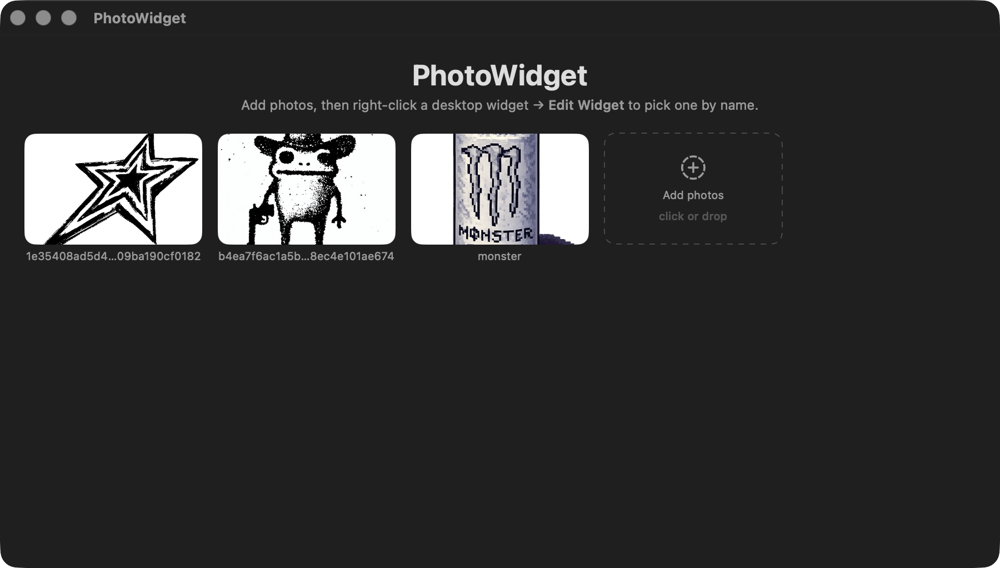

# PhotoWidget

Put your own photos on the macOS desktop as widgets.

| App | Widget |
|---|---|
|  |  |

- Add any number of photos (click **Add photos** or drag & drop; multi-select works)
- Place as many Photo Widgets as you like — small, medium, large, extra large
- Right-click a widget → **Edit Widget** to pick a photo *by name*, choose
  **Fill** or **Fit** scaling, and **Always full color** vs **Tint with system style**
- Photos render in full color even when macOS widget style is Monochrome

## Install

1. Download `PhotoWidget.dmg` from the [latest release](../../releases/latest).
2. Open it and drag **PhotoWidget** into **Applications**.
3. First launch: **right-click the app → Open → Open**. (The app is signed
   with a personal development certificate, not notarized by Apple, so plain
   double-click is blocked. On macOS 15+ you may instead need to allow it
   under **System Settings → Privacy & Security → Open Anyway**.)
4. Add some photos in the app.
5. Right-click the desktop → **Edit Widgets…** → search "PhotoWidget" → add it.
6. Right-click the widget → **Edit Widget** to choose which photo it shows.

Requires macOS 14 (Sonoma) or newer. Widgets show in full color when
System Settings → Desktop & Dock → Widgets → Style is "Full colour";
in "Monochrome" the photo still shows (the app opts out of tinting) unless
you pick "Tint with system style" per widget.

## How it works

Two targets: a SwiftUI app and a WidgetKit extension. The app downscales each
photo to JPEG and stores it in a shared App Group container; the widget's
`AppIntentConfiguration` lists those files by name in the Edit Widget picker
and renders the chosen one. The app pushes `reloadAllTimelines()` whenever the
library changes.

## Build from source

Requirements: Xcode, an Apple Development certificate in your keychain
(a free Apple ID works), Ruby `xcodeproj` gem.

```bash
# One-time: change the bundle prefix + App Group to YOUR team.
# The App Group id must be "<TEAMID>.<prefix>" (team-prefixed groups need no
# paid account). It appears in 4 files: both .swift and both .entitlements.
export PW_BUNDLE_PREFIX=com.yourname.photowidget

```

The `.xcodeproj` is generated by `gen_project.rb` — regenerate it rather than
editing project settings in Xcode.
